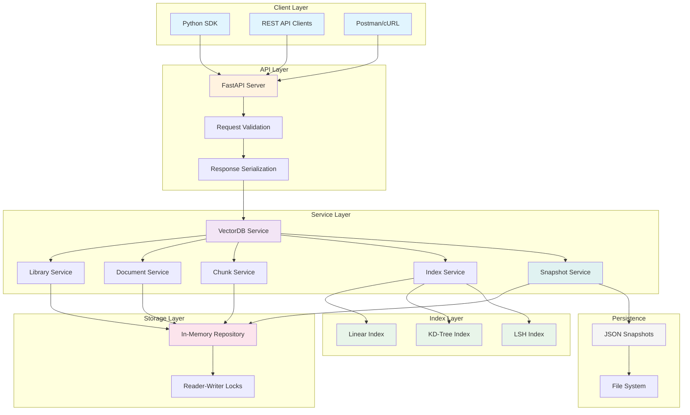
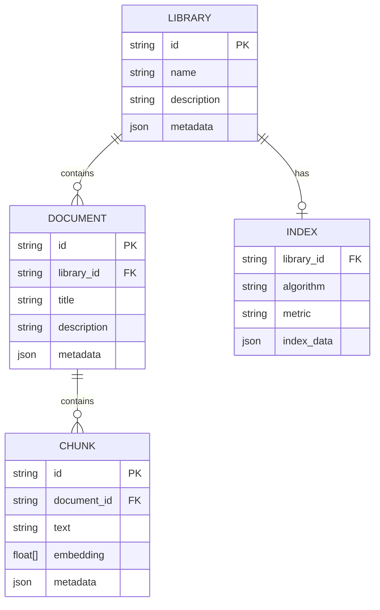
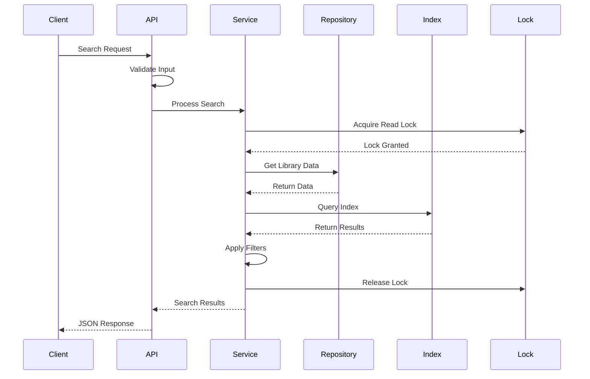

# VectorDB

<div align="center">
In-memory vector database with pluggable indexing algorithms, metadata filtering, and a FastAPI-based REST API.
</div>

---

## Table of Contents

- [Features](#features)
- [Architecture](#architecture)
- [Quick Start](#quick-start)
- [Configuration](#configuration)
- [API Documentation](#api-documentation)
- [Python SDK](#python-sdk)
- [Indexing Algorithms](#indexing-algorithms)
- [Testing](#testing)

## Features

### Core Capabilities

- Multiple Indexing Algorithms: Linear, KD-Tree, and LSH (Locality Sensitive Hashing)
- Flexible Similarity Metrics: Cosine similarity and Euclidean distance
- Metadata Filtering: Filter search results by custom metadata
- Persistence: Snapshot and restore functionality for data durability
- Thread-Safe: Custom reader-writer locks for concurrent operations
- In-Memory: Fast access with in-memory storage
- RESTful API: Full CRUD operations via FastAPI
- Python SDK: Native client library for seamless integration
- Embeddings API: Integrated Cohere support for text embeddings

### Key Benefits

- **Production Ready**: Docker support, health checks, and graceful shutdown
- **Scalable**: Per-library indices and lightweight design
- **Extensible**: Modular design for easy algorithm additions
- **Developer Friendly**: Comprehensive API, SDK, and Postman collection

## Architecture

### System Overview

The VectorDB system follows a layered architecture with clear separation of concerns. Each layer has specific responsibilities and communicates through well-defined interfaces.



### Data Model Hierarchy



### Request Flow



### Concurrency Model

The system uses a custom Reader-Writer lock implementation that:

- Allows multiple concurrent read operations for high throughput
- Ensures exclusive write access for data consistency
- Implements writer priority to prevent starvation
- Uses context managers for clean resource management

# Quick Start

### Using Docker (Recommended)

```bash
# Clone the repository
git clone https://github.com/yourusername/vectordb.git
cd vectordb

# Run with Docker
docker-compose up

# API available at http://localhost:8000
```

### Local Development

```bash
python -m venv .venv
source .venv/bin/activate

pip install -r requirements.txt

make run

uvicorn app.main:app --reload --port 8000
```

### JWT Authentication Setup

**⚠️ Important**: All API endpoints (except `/health`) require JWT authentication. You must configure a JWT secret key before making requests.

1. **Create `.env` file** in the project root:

```bash
# .env
JWT_SECRET_KEY=your-secret-key-here-minimum-32-characters
```

2. **Generate a JWT token**:

```bash
python generate_token.py
```

This will output a token that you can use for API requests.

3. **Use the token in requests**:

```bash
# Using curl
curl -H "Authorization: Bearer <your-token>" http://localhost:8000/libraries/

# Or in Python SDK (if updated to support auth)
client = VectorDBClient(
    base_url="http://localhost:8000",
    token="<your-token>"
)
```

**Note**: If `JWT_SECRET_KEY` is not set in `.env` or environment variables, the service will generate a random key on startup. This means:
- ✅ The service will start successfully
- ❌ You won't be able to access any endpoints (except `/health`) because you won't know the randomly generated key
- 💡 Always set `JWT_SECRET_KEY` explicitly for development and production

### Quick Example

```python
from sdk.client import VectorDBClient

# Initialize client
client = VectorDBClient(base_url="http://localhost:8000")

# Create a library
library = client.create_library("my-vectors", description="Demo library")

# Create a document
doc = client.create_document(
    library["id"],
    title="Sample Document",
    metadata={"category": "demo"}
)

# Add vector chunks
chunk = client.create_chunk(
    library["id"],
    doc["id"],
    text="The Eiffel Tower is in Paris",
    embedding=[0.1, 0.2, 0.3],  # Your embedding vector
    metadata={"language": "en"}
)

# Build an index for fast search (uses PUT under the hood)
client.build_index(library["id"], algorithm="lsh", metric="cosine")

# Search for similar vectors
results = client.search(
    library["id"],
    vector=[0.1, 0.15, 0.3],
    k=5,
    metadata_filters={"language": "en"}
)

print(f"Found {len(results['results'])} similar vectors")
```

# Configuration

Environment variables for customization:

| Variable         | Default | Description                            |
| ---------------- | ------- | -------------------------------------- |
| `ENV`            | `local` | Environment (local/staging/production) |
| `DATA_DIR`       | `data`  | Directory for snapshots                |
| `JWT_SECRET_KEY` | *random*| JWT secret key for authentication (required for API access) |
| `COHERE_API_KEY` | -       | API key for embeddings (optional)      |

## Production Deployment

### Multi-Worker Limitations

The default in-memory repository is **per-process** and not suitable for multi-worker deployments. When running with Gunicorn or similar WSGI servers with multiple workers:

- Each worker maintains its own separate data copy
- Data will diverge across workers
- Snapshots will not be shared between processes

### Solutions

1. **Single Worker Mode** (Quick fix):

   ```bash
   gunicorn app.main:app --workers 1
   ```

2. **Persistent Repository** (Recommended):
   Implement a file-based or database-backed repository, then configure via:

   ```python
   from app.repositories import FileRepository  # or PostgresRepository
   from app.services import set_repository

   # At startup
   repository = FileRepository(data_dir="/persistent/data")
   set_repository(repository)
   ```

3. **External Storage**:
   Use Redis, PostgreSQL, or another shared storage backend for production deployments.

| Variable         | Default  | Description               |
| ---------------- | -------- | ------------------------- |
| `DEFAULT_METRIC` | `cosine` | Default similarity metric |
| `DEFAULT_INDEX`  | `linear` | Default index algorithm   |
| `LSH_NUM_PLANES` | `16`     | LSH hash bit count        |
| `LSH_NUM_TABLES` | `4`      | LSH table count           |
| `LOG_LEVEL`      | `INFO`   | Logging verbosity         |

# API Documentation

- Swagger UI: `http://localhost:8000/docs`
- ReDoc: `http://localhost:8000/redoc`

### Core Endpoints

| Method              | Endpoint                                 | Description                      |
| ------------------- | ---------------------------------------- | -------------------------------- |
| **Libraries**       |
| POST                | `/libraries/`                            | Create a new library             |
| GET                 | `/libraries/`                            | List all libraries               |
| GET                 | `/libraries/{id}`                        | Get library details              |
| PATCH               | `/libraries/{id}`                        | Update library                   |
| DELETE              | `/libraries/{id}`                        | Delete library                   |
| **Documents**       |
| POST                | `/libraries/{id}/documents`              | Create document                  |
| GET                 | `/libraries/{id}/documents`              | List documents                   |
| GET                 | `/libraries/{id}/documents/{doc_id}`     | Get document details             |
| PATCH               | `/libraries/{id}/documents/{doc_id}`     | Update document                  |
| DELETE              | `/libraries/{id}/documents/{doc_id}`     | Delete document                  |
| **Chunks**          |
| POST                | `/libraries/{id}/chunks`                 | Create chunk                     |
| GET                 | `/libraries/{id}/chunks`                 | List chunks                      |
| GET                 | `/libraries/{id}/chunks/{chunk_id}`      | Get chunk details                |
| PATCH               | `/libraries/{id}/chunks/{chunk_id}`      | Update chunk                     |
| DELETE              | `/libraries/{id}/chunks/{chunk_id}`      | Delete chunk                     |
| **Index & Search**  |
| PUT                 | `/libraries/{id}/index`                  | Create/replace index             |
| GET                 | `/libraries/{id}/index`                  | Get index info                   |
| DELETE              | `/libraries/{id}/index`                  | Clear index                      |
| POST                | `/libraries/{id}/chunks/search`          | Search vectors                   |
| **Admin/Snapshots** |
| GET                 | `/admin/snapshots`                       | List all snapshots               |
| POST                | `/admin/snapshots`                       | Create snapshot                  |
| GET                 | `/admin/snapshots/{snapshot_id}`         | Get snapshot details             |
| POST                | `/admin/snapshots/{snapshot_id}/restore` | Restore from snapshot (sync 200) |
| DELETE              | `/admin/snapshots/{snapshot_id}`         | Delete snapshot                  |
| **Utilities**       |
| GET                 | `/health`                                | Health check                     |
| POST                | `/embeddings`                            | Generate embeddings              |

### Example API Calls

**Note**: All endpoints require JWT authentication. Include the token in the `Authorization` header:
```bash
-H "Authorization: Bearer <your-jwt-token>"
```

```bash
# Create a library
curl -X POST http://localhost:8000/libraries/ \
  -H "Authorization: Bearer <your-jwt-token>" \
  -H "Content-Type: application/json" \
  -d '{
    "name": "product-embeddings",
    "description": "Product description vectors",
    "metadata": {"version": "1.0"}
  }'

# Create a document
curl -X POST http://localhost:8000/libraries/{library_id}/documents \
  -H "Authorization: Bearer <your-jwt-token>" \
  -H "Content-Type: application/json" \
  -d '{
    "title": "Product Catalog",
    "description": "Product descriptions",
    "metadata": {"category": "electronics"}
  }'

# Create a chunk with embedding
curl -X POST http://localhost:8000/libraries/{library_id}/chunks \
  -H "Authorization: Bearer <your-jwt-token>" \
  -H "Content-Type: application/json" \
  -d '{
    "document_id": "{document_id}",
    "text": "High-quality wireless headphones",
    "embedding": [0.1, 0.2, 0.3, 0.4],
    "metadata": {"category": "electronics"}
  }'

# Build an index (create/replace)
curl -X PUT http://localhost:8000/libraries/{library_id}/index \
  -H "Authorization: Bearer <your-jwt-token>" \
  -H "Content-Type: application/json" \
  -d '{
    "algorithm": "kdtree",
    "metric": "euclidean"
  }'

# Search for similar vectors
curl -X POST http://localhost:8000/libraries/{library_id}/chunks/search \
  -H "Authorization: Bearer <your-jwt-token>" \
  -H "Content-Type: application/json" \
  -d '{
    "vector": [0.1, 0.2, 0.3, 0.4],
    "k": 10,
    "metadata_filters": {"category": "electronics"}
  }'

# Generate embeddings (requires COHERE_API_KEY)
curl -X POST http://localhost:8000/embeddings \
  -H "Authorization: Bearer <your-jwt-token>" \
  -H "Content-Type: application/json" \
  -d '{
    "text": "High-quality wireless headphones with noise cancellation"
  }'

# Create a snapshot
curl -X POST http://localhost:8000/admin/snapshots \
  -H "Authorization: Bearer <your-jwt-token>" \
  -H "Content-Type: application/json" \
  -d '{
    "name": "backup_before_migration"
  }'

# List all snapshots
curl -X GET http://localhost:8000/admin/snapshots \
  -H "Authorization: Bearer <your-jwt-token>"

# Restore from snapshot (synchronous)
curl -X POST http://localhost:8000/admin/snapshots/{snapshot_id}/restore \
  -H "Authorization: Bearer <your-jwt-token>"
```

# Python SDK

### Installation

### Complete Example

```python
"""
Пример использования VectorDB SDK с зашифрованными JWT токенами.

Структура данных в VectorDB:
- Library (библиотека) - верхний уровень, содержит коллекцию документов
- Document (документ) - имеет title (название) и description, принадлежит Library
- Chunk (чанк) - имеет text (текстовое содержимое для поиска) и embedding (вектор), 
  принадлежит Document. Поиск производится именно по чанкам.

Важно понимать:
- Document.title - это НАЗВАНИЕ документа (например, "Статья о CI/CD")
- Chunk.text - это СОДЕРЖИМОЕ текста для поиска (например, "ci/cd пайплайн какие есть плюсы")
- Один документ может содержать несколько чанков с разным содержимым
"""

import os
from dotenv import load_dotenv
from sdk.client import VectorDBClient

# Загружаем переменные из .env файла
load_dotenv()

class VectorDBManager:
    def __init__(self, token: str, base_url="http://localhost:8000"):
        """
        Инициализация менеджера VectorDB.
        
        Args:
            base_url: URL API сервера
            token: Зашифрованный JWT токен. Если не передан, генерируется автоматически.
                   Токен должен быть зашифрованным (используйте generate_token.py для генерации)
        """
        
        self.token = token
        self.client = VectorDBClient(base_url=base_url, token=token)

    def get_library_id(self, name: str) -> str:
        library = self.get_library_by_name(name)
        return library["id"]

    def get_library_by_name(self, name: str) -> str:
        libraries = self.client.list_libraries()
        for library in libraries:
            if library["name"] == name:
                return library
        raise ValueError(f"Library {name} not found")

    def setup_library(self, name: str) -> str:
        """Create and configure a new library"""
        library = self.client.create_library(
            name=name,
            description=f"{name} vector collection",
            metadata={"created_by": "sdk"}
        )
        return library["id"]

    def add_vectors(self, library_id: str, vectors: list, texts: list, document_title: str = "Batch Import"):
        """
        Добавляет векторы и тексты как чанки в один документ.
        
        Важно: 
        - texts содержит СОДЕРЖИМОЕ текста для чанков (chunk.text), а не названия документов
        - Все тексты добавляются как чанки в один документ с указанным title
        - Поиск производится по chunk.text (содержимое), а не по document.title (название)
        
        Args:
            library_id: ID библиотеки
            vectors: Список векторов (embeddings) для каждого текста
            texts: Список текстового содержимого для чанков (chunk.text)
            document_title: Название документа (document.title). 
                           Все чанки будут принадлежать этому документу
        """
        # Создаем документ с указанным названием (title)
        # title - это НАЗВАНИЕ документа, не содержимое текста
        doc = self.client.create_document(
            library_id,
            title=document_title,  # Название документа (например, "Статья о DevOps")
            metadata={"type": "bulk"}
        )

        chunks = []
        # Для каждой пары (вектор, текст) создаем чанк
        # text здесь - это СОДЕРЖИМОЕ для поиска (chunk.text)
        for vector, text in zip(vectors, texts):
            chunk = self.client.create_chunk(
                library_id,
                doc["id"],  # Все чанки принадлежат одному документу
                text=text,  # Содержимое текста для поиска (chunk.text)
                embedding=vector.tolist() if hasattr(vector, 'tolist') else vector,
                metadata={"source": "batch"}
            )
            chunks.append(chunk)

        return chunks
    
    def add_vectors_separate_documents(self, library_id: str, document_titles: list, vectors: list, texts: list):
        """
        Добавляет векторы и тексты, создавая отдельный документ для каждой пары.
        
        Этот метод полезен, когда каждому тексту нужно присвоить отдельное название документа.
        
        Args:
            library_id: ID библиотеки
            document_titles: Список названий документов (document.title)
            vectors: Список векторов для каждого текста
            texts: Список текстового содержимого для чанков (chunk.text)
        """
        if len(document_titles) != len(vectors) or len(vectors) != len(texts):
            raise ValueError("Количество названий документов, векторов и текстов должно совпадать")
        
        chunks = []
        for title, vector, text in zip(document_titles, vectors, texts):
            # Создаем отдельный документ для каждого текста
            doc = self.client.create_document(
                library_id,
                title=title,  # Название документа
                metadata={"type": "individual"}
            )
            
            # Создаем один чанк в этом документе
            chunk = self.client.create_chunk(
                library_id,
                doc["id"],
                text=text,  # Содержимое текста для поиска
                embedding=vector.tolist() if hasattr(vector, 'tolist') else vector,
                metadata={"source": "individual"}
            )
            chunks.append(chunk)
        
        return chunks

    def embed_local(self, texts: list) -> list:
        """Embed text using local russian BERT model"""
        return [self.client.embed_local(text) for text in texts]

    def similarity_search(self, library_id: str, query_vector: list, k: int = 5):
        """Perform similarity search"""
        # Build index if needed
        self.client.build_index(library_id, algorithm="lsh", metric="cosine")

        # Search
        results = self.client.search(
            library_id,
            vector=query_vector,
            k=k
        )

        return results

# ============================================================================
# ИСПОЛЬЗОВАНИЕ С ЗАШИФРОВАННЫМИ ТОКЕНАМИ
# ============================================================================
token = os.getenv("ENCRYPTION_TOKEN", None)
if token is None:
    raise ValueError("ENCRYPTION_TOKEN is not set")

manager = VectorDBManager(token=token)

# ============================================================================
# СОЗДАНИЕ БИБЛИОТЕКИ
# ============================================================================

# Создаем новую библиотеку или получаем существующую
# Важно: наименование библиотеки может быть не уникальным по условию работы ядра
# Для уникальности наименований можно использовать верхнеуровневые конструкции
# такие как эта
lib_name = "demo"
try:
    lib_id = manager.get_library_id(lib_name)
except ValueError:
    lib_id = manager.setup_library(lib_name)

# ============================================================================
# ВАРИАНТ 1: Добавление векторов в один документ
# ============================================================================

# ВАЖНО: texts содержит СОДЕРЖИМОЕ текста для чанков (chunk.text), 
# а не названия документов. Это текст, по которому будет производиться поиск.

# Пример: содержимое текстов для чанков (это то, что будет искаться)
# Важно понимать, что это чанки ОДНОГО документа, если будет найден хотя бы один из этихчанков,
# то будет возвращен весь этот документ, даже если кажется, что он не соответствует запросу
texts = [
    "поешь этих мягких французских булок да выпей чаю",  # chunk.text - содержимое
    "ci/cd пайплайн какие есть плюсы",                    # chunk.text - содержимое
    "обеспечение качества в devops"                       # chunk.text - содержимое
]

# Генерируем векторы (embeddings) для каждого текста
vectors = [manager.client.embed_local(text)["embedding"] for text in texts]

# Добавляем все векторы как чанки в один документ
# Все чанки будут принадлежать документу с названием "Batch Import"
# Поиск будет производиться по chunk.text (содержимое текста)
chunks = manager.add_vectors(
    lib_id, 
    vectors, 
    texts,
    document_title="Коллекция текстов о разработке"  # document.title - название документа
)

print(f"Добавлено {len(chunks)} чанков в документ")

# ============================================================================
# ВАРИАНТ 2: Добавление векторов в отдельные документы
# ============================================================================

# Если нужно создать отдельный документ для каждого текста:
# document_titles = ["Документ о CI/CD", "Документ о DevOps", "Документ о качестве"]
# chunks_separate = manager.add_vectors_separate_documents(
#     lib_id,
#     document_titles,  # Названия документов (document.title)
#     vectors,          # Векторы для каждого текста
#     texts             # Содержимое текстов для чанков (chunk.text)
# )

# ============================================================================
# ПОИСК ПО СХОДСТВУ
# ============================================================================

# Поиск производится по чанкам (chunks), а не по документам
# Результаты поиска содержат chunk.text (содержимое), chunk.document_id и другие поля

# Генерируем вектор для поискового запроса
query_text = "ci cd пайплайн"
query_vector = manager.embed_local(query_text)[0]["embedding"]

# Или используем готовый вектор:
# query_vector = [0.15, 0.25, 0.35, ...]

# Выполняем поиск (автоматически строит индекс, если его нет)
results = manager.similarity_search(lib_id, query_vector, k=2)

print(f"\nНайдено {len(results['results'])} похожих чанков:")
for i, result in enumerate(results['results'], 1):
    print(f"\n{i}. Чанк ID: {result['chunk_id']}")
    print(f"   Документ ID: {result['document_id']}")
    print(f"   Текст (chunk.text): {result['text']}")  # Содержимое текста чанка
    print(f"   Схожесть (score): {result['score']}")

# ============================================================================
# КОММЕНТИРОВАННЫЙ ПРИМЕР С РУЧНЫМИ ВЕКТОРАМИ
# ============================================================================

# Пример с заранее подготовленными векторами (без использования embed_local):
# texts = ["Document 1", "Document 2", "Document 3"]  # Содержимое для чанков
# Важно: при добавлении векторов вручную, необходимо учитывать существующую размерность векторов в библиотеке
# Иначе будет ошибка 400 bad request при попытке добавить новый вектор с другой размерностью
# vectors = [[0.1, 0.2, 0.3], [0.2, 0.3, 0.4], [0.3, 0.4, 0.5]]
# manager.add_vectors(lib_id, vectors, texts, document_title="Ручные векторы")

# Поиск с готовым вектором:
# query_vector = [0.15, 0.25, 0.35]
# results = manager.similarity_search(lib_id, query_vector, k=2)
```

# Indexing Algorithms

### Algorithm Comparison

| Algorithm   | Build Time | Search Time | Memory |
| ----------- | ---------- | ----------- | ------ |
| **Linear**  | O(1)       | O(n)        | O(n)   |
| **KD-Tree** | O(n log n) | O(log n)\*  | O(n)   |
| **LSH**     | O(n×t×p)   | O(t×m)      | O(n×t) |

\*Average case; worst case O(n) for KD-Tree

### Supported Metric Combinations

| Algorithm | Cosine Similarity | Euclidean Distance |
| --------- | ----------------- | ------------------ |
| Linear    | ✅                | ✅                 |
| KD-Tree   | ❌                | ✅                 |
| LSH       | ✅                | ❌                 |

# Testing

### Run Tests

```bash
# Run all tests
pytest

# Run with coverage
pytest --cov=app --cov-report=html

# Run specific test file
pytest app/tests/test_api_libraries.py

# Run integration tests
pytest app/tests/test_indexing_and_search.py -v
```

### Test Coverage

- Unit tests for all services
- Integration tests for API endpoints
- Persistence validation

### Project Structure

```
vectordb/
├── app/
│   ├── api/            # FastAPI routers
│   │   └── routers/    # API endpoints
│   ├── core/           # Core configuration
│   ├── domain/         # Business entities
│   │   ├── dto/        # Data transfer objects
│   │   └── models/     # Domain models
│   ├── repositories/   # Data access layer
│   ├── services/       # Business logic
│   ├── vector_index/   # Index implementations
│   └── tests/          # Test suite
├── sdk/                # Python client library
├── scripts/            # Utility scripts
└── postman/            # API collection
```

### .vscode/launch.json for debug

```json
{
    "version": "0.2.0",
    "configurations": [
        {
            "name": "Python: Debug Current File",
            "type": "python",
            "request": "launch",
            "program": "${file}",
            "console": "integratedTerminal",
            "justMyCode": false
        },
        {
            "name": "Gunicorn: Debug Server",
            "type": "python",
            "request": "launch",
            "module": "gunicorn",
            "args": [
                "app.main:app",
                "--workers",
                "1",
                "--bind",
                "0.0.0.0:8000",
                "--worker-class",
                "uvicorn.workers.UvicornWorker",
                "--timeout",
                "120"
            ],
            "jinja": true,
            "justMyCode": false,
            "console": "integratedTerminal",
            "env": {
                "ENV": "development",
                "LOG_LEVEL": "DEBUG"
            },
            "cwd": "${workspaceFolder}"
        }
    ]
}
```

## Notes

- Indices are built per-library and cached in-memory. Snapshot persistence saves data and index metadata; indices are rebuilt on load.
- The `/embeddings` endpoint requires a valid `COHERE_API_KEY` and proxies to Cohere with retry logic. Without the key, it returns 503.
